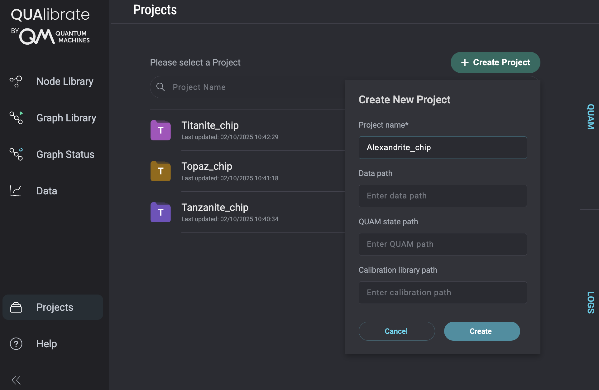

# Projects

Switching chips between fridges, splitting lab time between researchers, or running multiple calibration efforts on the same hardware all require different data paths and calibration context. Projects capture those differences so you can jump between setups without touching raw configuration files.

Typical project changes include:

- which **storage location** run data is stored in
- which **QUAM state** the system should load
- which **calibration library folder** to use

Qualibrate Projects package these overrides into named profiles that you can select in seconds—either from the web app or via the CLI. You can extend a project with additional configuration keys, but these three are the ones most teams swap when moving between experiments.

## Choose a Project in the Web App

The Projects page is the quickest way to review existing projects, switch the active one, or create a new profile. Selecting a project immediately updates the active context for the entire app.



Creating a project in the web interface prompts you for the storage location, calibration library folder, and QUAM state path. Leave any field blank to keep the value inherited from the global configuration. Once saved, the project appears in the list so you can switch back to it whenever needed.

## Manage Projects from the CLI

For scripted workflows or remote access, the `qualibrate project` command group mirrors everything you can do in the web app. Add `--config-path` if you keep your configs somewhere other than `~/.qualibrate/config.toml`.

### Create a project

```bash
qualibrate project create <name> [--storage-location PATH] [--calibration-library-folder PATH] [--quam-state-path PATH]
```

Writes a minimal `config.toml` for the project containing only the overrides you provide.

### List projects

```bash
qualibrate project list [--verbose]
```

Shows every project in `~/.qualibrate/projects`; verbose mode adds metadata such as creation timestamps, last modification, and stored overrides.

### Show the active project

```bash
qualibrate project current
```

Reveals which project QUAlibrate will use for the next runs.

### Switch projects

```bash
qualibrate project switch <name>
```

Immediately updates the global configuration so both the CLI and web app operate under the selected project.

### Delete a project

```bash
qualibrate project delete <name>
```

Removes the project directory, blocking deletion if that project is currently active.

!!! note "Advanced overrides"
    Only the three common paths are exposed as CLI flags or web form fields today. You can open a project’s `config.toml` and add any other configuration entries manually whenever you need custom behaviour.

## How Projects Work

Projects extend the main configuration file located at `~/.qualibrate/config.toml`.

- The active project name lives in the `qualibrate.project` entry of the global config.
- Each project stores only its overrides under `~/.qualibrate/projects/<name>/config.toml`.
- At runtime, QUAlibrate merges the two files so that missing project values fall back to the global configuration.

```
~/.qualibrate/
├── config.toml                 # global defaults + active project name
└── projects/
    └── <project>/config.toml   # optional overrides
```

When a project does not override a setting, QUAlibrate simply uses the value from the global configuration, making projects an optional layer rather than a requirement.
