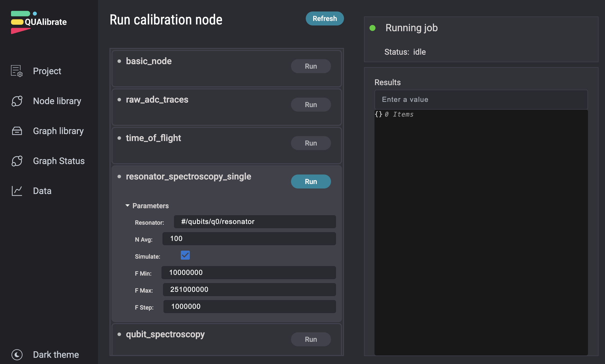
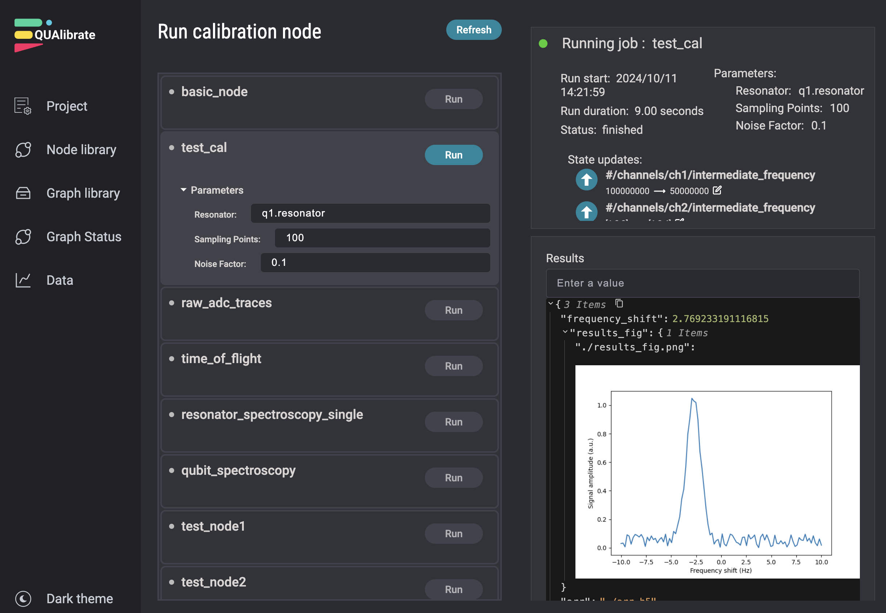
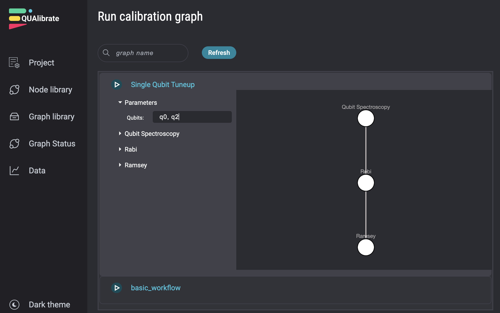
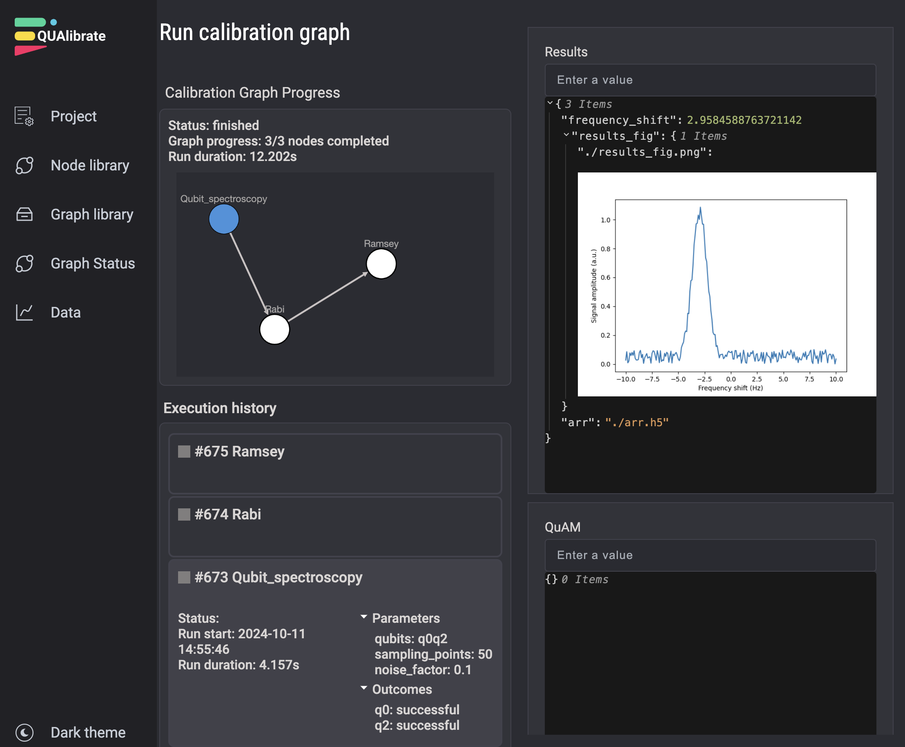
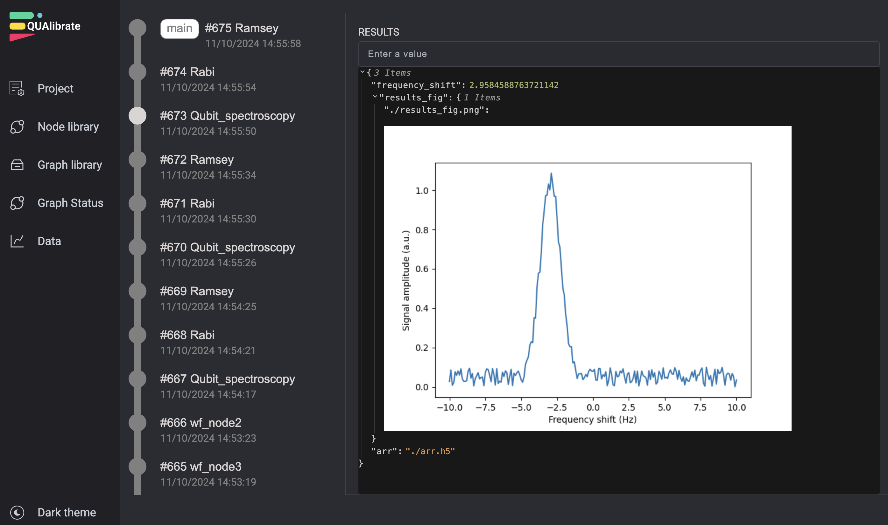

# Web App

QUAlibrate comes with a dedicated web app, enabling you to run any `QualibrationNode` and `QualibrationGraph` through an intuitive frontend.
The web app can be started by running the following command in the terminal:

```bash
qualibrate start
```
A message should appear in the terminal specifying the URL to access the Web App, the default being [http://localhost:8001/]().


## Node Execution Page

When accessing the URL on a web browser, you should be greeted by the `Node Execution` page:

{ max-width="700px" }

This webpage contains a list of all nodes registered in the  `qualibrate_runner.calibration_library_folder` path in the [configuration file](configuration.md).
If you don't see any nodes in here, it may be because no nodes have yet been added to this folder.

When selecting a node, the `NodeParameters` defined in the `QualibrationNode` file are displayed along with their default values.
These default values can be overwritten, and the node can then be executed by pressing the `Run` button.

After the node execution has finished, the results are shown on the right-hand side.
{ max-width="700px" }
Additionally, `State updates` may be shown if QUAM entries have been updated using `with node.record_state_updates():` (see [calibration nodes](calibration_nodes.md) for details).


## Graph library Page

The Web App also supports running calibration graphs through the `Graph Library` page.
Any `QualibrationGraph` stored in the calibration library folder is displayed here and can be run with custom parameters.
For example, the user can specify the targets (qubits) that the node should be applied to.
Additionally, node-specific parameters can also be modified.
The graph can be run by pressing the blue `play` triangle.

{ max-width="700px" }


## Graph Status Page

Once a job to run a graph has been dispatched, you will be redirected to the `Graph Status` page.
Here you can see the progress of the graph execution, including the results of executed nodes.

{ max-width="700px" }

## Data Page

The `Data` page shows the results of all nodes that have been executed.
This includes the node results, but also the QUAM state, and any updates to QUAM that occured while executing this node.

{ max-width="700px" }